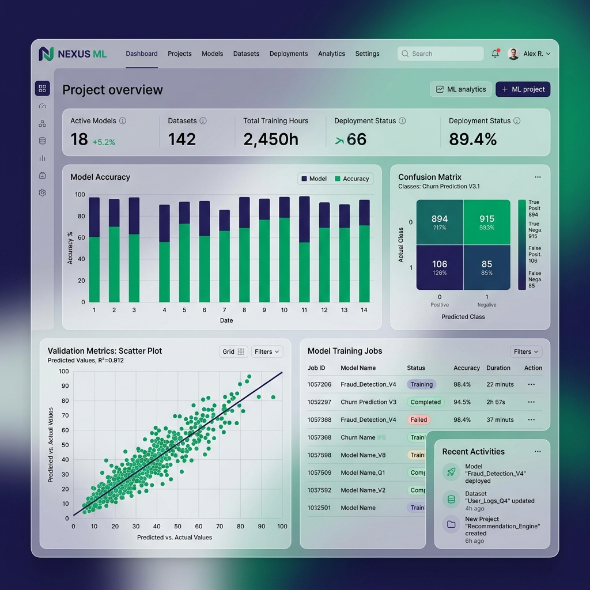
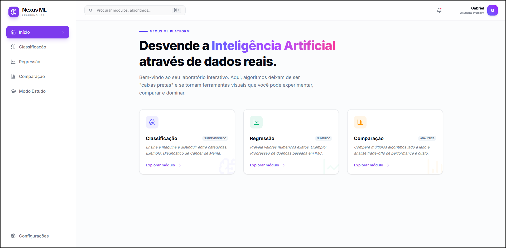
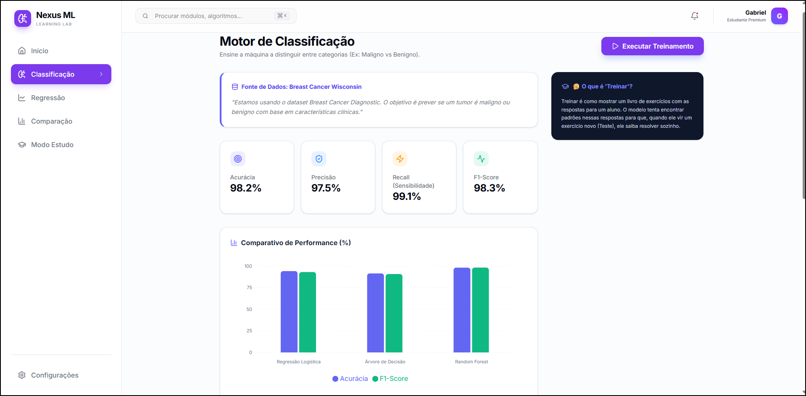
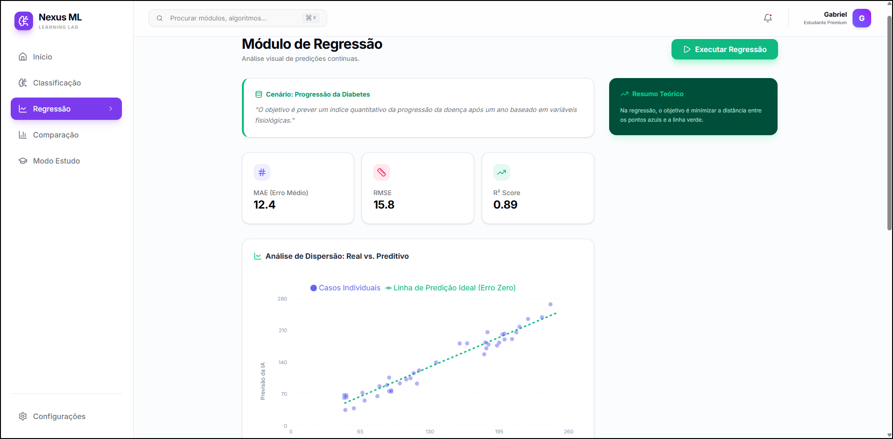
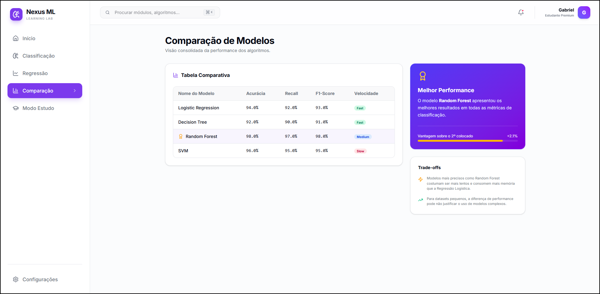
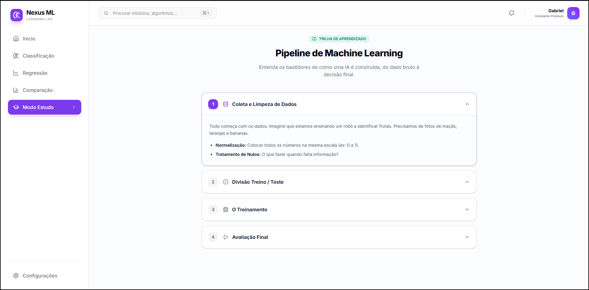

# Nexus ML - Learning Lab 🧠

Nexus ML é uma plataforma educacional de ponta projetada para transformar o aprendizado de Machine Learning em uma experiência visual, interativa e profissional. O laboratório permite que estudantes experimentem algoritmos reais, analisem métricas de performance e utilizem simuladores para prever resultados em tempo real.


*Visualização premium da interface do Nexus ML Learning Lab.*


*Visão geral do painel de controle e navegação.*

---

## 🎓 O que foi Implementado (Conceitos Ensinados)

Esta plataforma foi construída para ensinar os pilares do Aprendizado Supervisionado:

### 1. Módulo de Classificação (Diagnóstico)
- **O Problema**: Identificar categorias (Benigno vs. Maligno) usando o dataset de Câncer de Mama da UCI.
- **Métricas Ensinadas**: 
    - **Acurácia**: Taxa de acerto geral.
    - **Recall (Sensibilidade)**: Vital na saúde para não deixar passar nenhum caso positivo.
    - **F1-Score**: O equilíbrio entre precisão e sensibilidade.
- **Visualização**: Gráficos comparativos entre Regressão Logística, Árvores de Decisão e Random Forest.


*Análise detalhada de métricas e performance de modelos de classificação.*

### 2. Módulo de Regressão (Predição Numérica)
- **O Problema**: Prever a progressão da Diabetes (valor numérico contínuo) após um ano.
- **Métricas Ensinadas**:
    - **MAE (Erro Médio Absoluto)**: A média do "erro" em unidades reais.
    - **R² Score**: Quanto o modelo explica a variabilidade dos dados (0 a 1).
- **Visualização**: Gráfico de dispersão com a **Linha de Predição Ideal**, demonstrando visualmente o erro do modelo.


*Visualização da linha de tendência e distribuição dos erros na predição de diabetes.*

### 3. Simulador de Inferência
- Permite ao usuário inserir dados manuais (IMC, Idade, Raio do Tumor) e receber uma predição instantânea com uma **Explicação Dinâmica da IA** sobre os fatores que mais influenciaram o resultado.


*Interface de comparação e simulador interativo de resultados.*

---

## 🚀 Como Rodar o Projeto

### Pré-requisitos
- Python 3.8+
- Node.js 18+

### 1. Iniciar o Backend (Engine de IA)
O backend processa os cálculos matemáticos e treina os modelos.

```powershell
# Instale as dependências de IA
pip install -r requirements.txt

# Inicie o servidor FastAPI
python main.py
```
A API estará disponível em `http://localhost:8000`.

### 2. Iniciar o Frontend (Interface SaaS)
A interface moderna que consome os dados da API.

```powershell
cd frontend

# Instale os pacotes
npm install

# Inicie o ambiente de desenvolvimento
npm run dev
```
Acesse no navegador: `http://localhost:5173` (ou 5174).

---

## 🛠️ Pontos de Customização (Onde Alterar)

Se você deseja expandir o laboratório, aqui estão os pontos principais:

1.  **Trocar o Dataset**:
    - Altere o arquivo `services/data_loader.py` para carregar qualquer outro dataset do Scikit-Learn ou um arquivo CSV local.
2.  **Adicionar Novos Modelos**:
    - No arquivo `services/model_trainer.py`, você pode importar e adicionar novos algoritmos como **SVM**, **KNN** ou **XGBoost**.
3.  **Alterar o Design System**:
    - O projeto utiliza **Tailwind CSS 4**. Você pode customizar as cores globais e tokens no arquivo `src/index.css`.
4.  **Lógica do Simulador**:
    - Para mudar como a IA explica o resultado no simulador, edite a função `handlePredict` dentro das páginas `Classification.jsx` ou `Regression.jsx`.

---

## 📂 Estrutura Profissional

- `frontend/src/pages`: Contém as visualizações e lógica de UI.
- `modules/`: Contém a inteligência dos pipelines de ML.
- `main.py`: Gateway de comunicação entre a IA e o Usuário.

---


*Componentes educacionais integrados para facilitar o aprendizado teórico.*

---
Desenvolvido com ❤️ por Antigravity.
